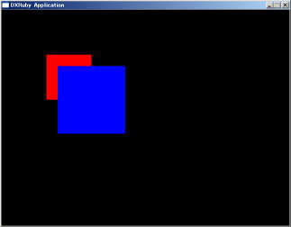
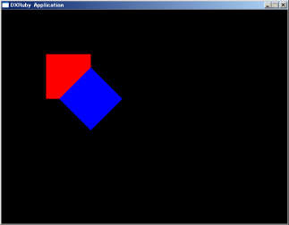
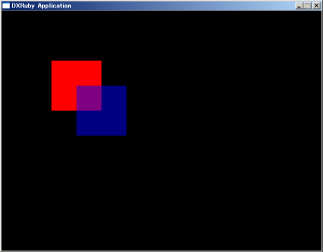
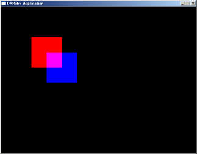
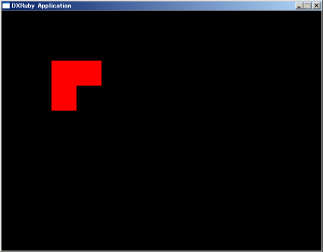
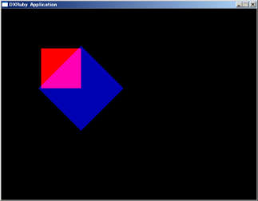

# 描画の効果について

Window.draw系のメソッドには、draw（通常描画）、draw_scale（拡大縮小）、draw_rot（回転）、draw_alpha（半透明）、draw_add（加算合成）、draw_sub（減算合成）、draw_ex（フルオプション）があります。
ここでは、それぞれの効果の例を挙げていきます。

## draw_scale
draw_scaleは拡大・縮小描画をすることができます。
引数の3つ目と4つ目でそれぞれ横、縦の拡大率を指定します。
1で等倍となります。
またマイナスの値を指定すると反転しますので、-1で左右、上下反転の絵を描画することができます。
5つ目と6つ目の引数は拡大・縮小の際の中心位置となります。
省略すると画像の中心となります。

```ruby
require 'dxruby'

image1 = Image.new(100, 100, [255, 0, 0])  # 赤い四角
image2 = Image.new(100, 100, [0, 0, 255])  # 青い四角

Window.loop do
  Window.draw(100, 100, image1)  # 赤い四角を描画する
  Window.draw_scale(150, 150, image2, 1.5, 1.5)  # 青い四角を描画する
end
```


また、Window.min_filter=とWindow.mag_filter=メソッドで、それぞれ縮小、拡大時のフィルタを選択することができます。
詳細はWindowモジュールのリファレンスを参照してください。


## draw_rot
draw_rotは画像を回転させることができます。
回転角度（360度）と、回転の中心位置を指定します。
中心位置は省略すると画像の中心となります。

```ruby
require 'dxruby'

image1 = Image.new(100, 100, [255, 0, 0])  # 赤い四角
image2 = Image.new(100, 100, [0, 0, 255])  # 青い四角

Window.loop do
  Window.draw(100, 100, image1)  # 赤い四角を描画する
  Window.draw_rot(150, 150, image2, 45)  # 青い四角を描画する
end
```



## draw_alpha
draw_alphaは半透明描画をします。
pngファイルを使うと、画像そのものにα値を設定することができますが、それではだんだん薄くするなどができません。
draw_alphaを使えば描画時にα値を指定できるので、自由に半透明化することができます。
引数にα値（0～255、0が完全に透明、255は完全に不透明）を指定します。

```ruby
require 'dxruby'

image1 = Image.new(100, 100, [255, 0, 0])  # 赤い四角
image2 = Image.new(100, 100, [0, 0, 255])  # 青い四角

Window.loop do
  Window.draw(100, 100, image1)  # 赤い四角を描画する
  Window.draw_alpha(150, 150, image2, 128)  # 青い四角を描画する
end
```


雲や霧、ガラスなど、向こう側が見えているけど少し色があるものなどに使います。


## draw_add
draw_addは加算合成を行います。
半透明合成はα値によって色を暗くしますが、加算合成は暗くせず、元の絵と描画する絵のRGBを単純に足し算します。

```ruby
require 'dxruby'

image1 = Image.new(100, 100, [255, 0, 0])  # 赤い四角
image2 = Image.new(100, 100, [0, 0, 255])  # 青い四角

Window.loop do
  Window.draw(100, 100, image1)  # 赤い四角を描画する
  Window.draw_add(150, 150, image2)  # 青い四角を描画する
end
```



単純足し算なので、赤と青が足されると紫になります。
主に爆発やレーザーなど、光の表現に使います。

## draw_sub
draw_subは減算合成です。
これは、名前に反して加算合成の逆ではないので、説明が必要でしょう。
減算合成は、描画する画像に色が指定されている部分(何色でも色があるだけで）を、黒くします。
従って、赤い絵に対して青い絵を減算合成すると、赤い絵も消えます。

```ruby
require 'dxruby'

image1 = Image.new(100, 100, [255, 0, 0])  # 赤い四角
image2 = Image.new(100, 100, [0, 0, 255])  # 青い四角

Window.loop do
  Window.draw(100, 100, image1)  # 赤い四角を描画する
  Window.draw_sub(150, 150, image2)  # 青い四角を描画する
end
```



主に画面のフェードイン／アウトなどの効果に使用します。


## draw_ex
これまで解説してきた効果をすべて、まとめてつけることができるメソッドです。
他のメソッドと違い、4つ目の引数にハッシュを渡すことでオプションを指定します。
指定方法の詳細はリファレンスのほうを参照してください。

```ruby
require 'dxruby'

image1 = Image.new(100, 100, [255, 0, 0])  # 赤い四角
image2 = Image.new(100, 100, [0, 0, 255])  # 青い四角

Window.loop do
  Window.draw(100, 100, image1)  # 赤い四角を描画する
  Window.draw_ex(150, 150, image2, :angle=>45, :alpha=>180, :scalex=>1.5, :scaley=>1.5, :blend=>:add)  # 青い四角を描画する
end
```



このメソッドは、これまでのそれぞれ単体ではできない効果を生み出すことができます。
この例では、半透明のα値を指定しつつ加算合成をしているので、効果が加算半透明となっています。
同様に減算半透明もできます。

