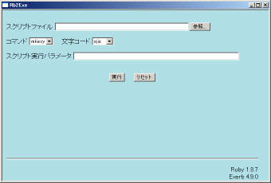
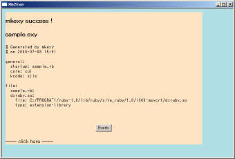
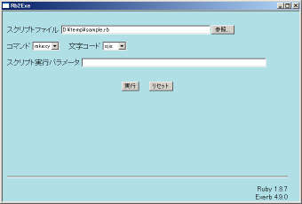
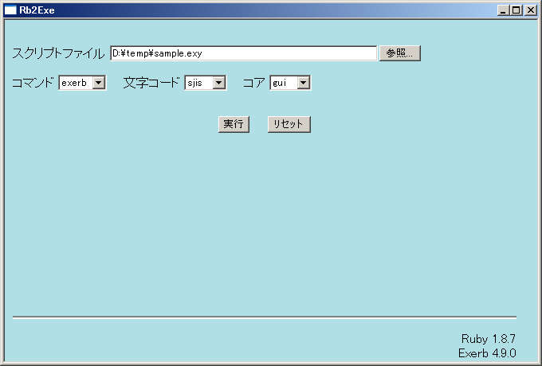
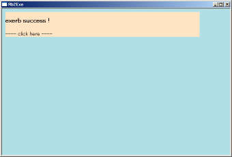

# Exerbによるexe化

ExerbはRuby1.8用のスクリプトをWindowsで実行できるexe形式にするためのYuya Kato氏作成のソフトです。
こちらからダウンロードできます。
http://exerb.sourceforge.jp/
ActiveScriptRubyに同梱されており、更に簡単にexeを生成できるrb2exeというツールまで含まれていますので、DXRubyを使う人にはActiveScriptRubyをオススメしています。

この項目では、ActiveScriptRubyのrb2exeを使ってexeファイルを作成する方法を説明します。

まず、exeファイルにするスクリプトを用意してください。
ここでは仮に、ディレクトリD:\tempに置いたsample.rbとしておきましょう。
rb2exeを起動するには、スタートメニューからプログラム→Ruby 1.8→rb2exeと選択します。
以下のような画面が表示されると思います。

スクリプトファイルの右の参照ボタンを押して、D:\temp\sample.rbを選択し、そのまま下の実行ボタンを押します。
すると、選択したファイルが実行されますので、終了させます。
なぜこんなことをするかというと、Exerbは実際にスクリプトを実行させてみて本当に必要なファイルをスキャンしているからです。
終了させると以下の画面になります。

表示されているのはExerbがexe化するのに使う設定ファイルの中身です。
これについて詳細を知りたい人はExerbのマニュアルを参照してください。
単純にexe化するだけなら知る必要はありません。
また、ここにいかにも押してくださいという感じでExerbボタンがあり、これを押すこと確かにexeを作ることはできますが、それをするとexeを実行したとき、メインウィンドウのほかににコマンドプロンプトウィンドウも表示される設定になります。
それでいい人はこのボタンでサクっとexe化しましょう。

コマンドプロンプトウィンドウを出ないようにするためには、もう一つ作業が必要です。
Exerbボタンではなく、ウィンドウ内の色が変わっているところをクリックすると画面が戻ります。

冷静に、書いてある順番に操作してみてください。
さきほどの操作で、sample.rbと同じディレクトリ（この例ではd:\temp)にsample.exyというファイルができているはずです。
ファイル名は実行するスクリプトにより変わりますが、拡張子がexyになっているファイルです。
スクリプトファイルの右の参照ボタンを押し、そのexyファイルを選択します。
そして、コマンドを選択してexerbに変更します。
すると右側にコアという項目が出現しますので、それを選択してguiに変更します。
以下のような画面になるはずです。
文字が潰れてみにくいと困るので縮小せずに貼り付けておきます。

この状態で、下の実行ボタンを押します。
すると、以下の画面になり、D:\tempにsample.exeができているはずです。

実行して動くことを確認しましょう。

この方法で作成したexeには、Rubyインタプリタと必要な拡張ライブラリ、ゲームのスクリプトが含まれます。
画像や音のファイルは含まれないので、配布する場合にはそれらも一緒に配布しましょう。

