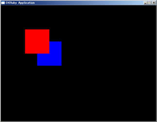

# 画像の描画順について

Window.draw系のメソッドの引数にzというものがあります。
これは3D的な奥行きではなく、描画順を表しています。
zを省略すると0となり、同じ値が指定されていると、Window.draw系を呼んだ順番に奥から描画されます。

```ruby
require 'dxruby'

image1 = Image.new(100, 100, [255, 0, 0])  # 赤い四角
image2 = Image.new(100, 100, [0, 0, 255])  # 青い四角

Window.loop do
  Window.draw(100, 100, image1)  # 赤い四角を描画する
  Window.draw(150, 150, image2)  # 青い四角を描画する
end
```


 zを指定すると、呼び出し順ではなく、zの順番にソートされます。

```ruby
require 'dxruby'

image1 = Image.new(100, 100, [255, 0, 0])  # 赤い四角
image2 = Image.new(100, 100, [0, 0, 255])  # 青い四角

Window.loop do
  Window.draw(100, 100, image1, 2)  # 赤い四角を描画する
  Window.draw(150, 150, image2, 1)  # 青い四角を描画する
end
```


zを省略すると0を指定したことと同じになり、全てのdrawで0が指定されていると、ソート処理は省略されます。
従って、全ての描画で描画順を指定しない場合に、描画処理は最も高速となります。

ソートする必要がないように処理の順番を考えるのが理想的ですが、DXRubyのソート処理はかなり高速ですので、必要とあらば遠慮なく使って問題ありません。

